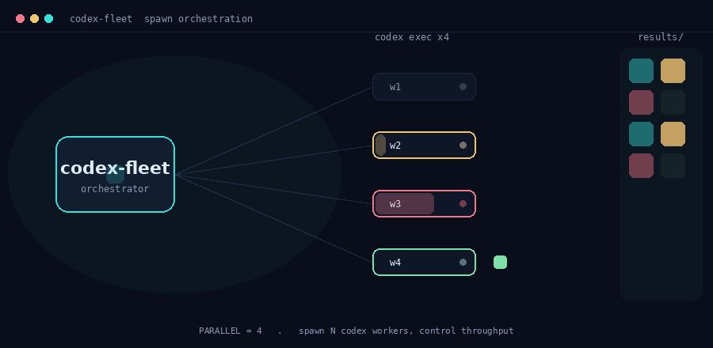

# codex-fleet

**Codex 워커를 함대처럼 띄워 양산하는 Claude Code 스킬 모음.**



> 오케스트레이터가 `codex exec` 워커를 N개 스폰 → 각자 처리 → 결과를 회수하는 흐름. 인터랙티브 버전(PARALLEL 슬라이더)은 **[데모 사이트](https://kimsh-1.github.io/codex-fleet/)** 에서.

`codex exec`(비대화형 Codex CLI) 프로세스를 백그라운드로 N개 동시에 띄워서, 이미지든 임의 작업이든 나눠 대량으로 뽑는다. 처리량은 스폰 개수 하나(`PARALLEL`)로 조절하고, 결과는 파일로 회수한다. HTTP를 다시 구현하는 게 아니라 **진짜 codex 프로세스를 여러 개 띄우는** 순수 CLI 스폰 패턴이다.

---

## 왜 만들었나

Codex로 이미지 600장을 뽑거나 파일 수십 개에 같은 작업을 돌릴 때, 하나씩 시키면 너무 느리다. 그렇다고 무작정 병렬로 돌리면 결과 파일이 엉키고, 어디까지 됐는지 추적도 안 되고, 죽이려다 실행 셸까지 같이 날리는 사고가 난다. 이 레포는 그 함정을 하나씩 다 밟아본 결과물이다.

핵심은 단순하다. **`codex exec`를 워커 풀로 묶어 스폰 수만 제어**하면 끝이다. 나머지(회수 레이스, resume, 모더레이션 거부, 프로세스 정리)는 스킬 문서에 함정으로 박아뒀다.

## 스킬 2종

| 스킬 | 용도 | 회수 방식 |
|---|---|---|
| **[codex-imagegen](skills/codex-imagegen/SKILL.md)** | gpt-image-2 이미지 대량생성 | codex가 `~/.codex/generated_images/`에 떨군 PNG를 회수 — **레이스 있음 → `claimed` 락으로 해결** |
| **[codex-spawn](skills/codex-spawn/SKILL.md)** | 코드 수정·분석·요약·리뷰 등 임의 작업 | `-o`(output-last-message)로 작업별 파일에 직접 받음 — **레이스 없음** |

둘 다 골격은 같다. `codex exec`를 `ThreadPoolExecutor(max_workers=PARALLEL)`로 백그라운드에 띄우고, 처리량은 `PARALLEL` 하나로 정한다. 차이는 결과를 어떻게 회수하느냐다.

## 빠른 시작

### 1. 연결 점검 (1개 테스트)

```bash
# 임의 작업
codex exec --skip-git-repo-check -s read-only -o /tmp/t.md "이 디렉토리를 3줄로 요약해" -C .
cat /tmp/t.md

# 이미지
codex exec 'Use $imagegen to generate a 1024x1024 red square test image. End turn immediately after.'
ls -lt ~/.codex/generated_images/**/ig_*.png | head -3
```

### 2. 배치 실행

임의 작업 (`tasks.jsonl` = 한 줄당 `{id, prompt, cwd?, schema?}`):

```bash
PARALLEL=4 TASKS=examples/tasks.jsonl OUTDIR=./out SANDBOX=read-only \
  python3 runners/codex_spawn_runner.py
```

이미지 (`manifest.jsonl` = 한 줄당 `{id, prompt, ar, size, output_path}`):

```bash
PARALLEL=3 PROMPTS=examples/manifest.jsonl OUTDIR=./out \
  python3 runners/codex_imagegen_runner.py
```

Codex CLI에 로그인돼 있으면 바로 된다. 스폰 수(`PARALLEL`)는 **3~6에서 시작**해, 머신 부하와 429를 보며 올린다. 한도는 ChatGPT 계정 단위라 스폰을 늘려도 계정 rate limit은 복제되지 않는다.

## 스킬로 설치

Claude Code 개인 스킬로 쓰려면 `skills/` 아래 두 폴더를 `~/.claude/skills/`에 심볼릭 링크하거나 복사한다.

```bash
ln -s "$PWD/skills/codex-imagegen" ~/.claude/skills/codex-imagegen
ln -s "$PWD/skills/codex-spawn"    ~/.claude/skills/codex-spawn
```

이후 Claude Code에서 `/codex-imagegen`, `/codex-spawn`으로 부르거나, "코덱스로 이미지 대량생성" 같은 트리거 문구로 작동한다.

## 함정 모음 (전부 한 번씩 밟아본 것들)

- **회수 레이스** — 이미지 병렬 스폰에서 워커 A의 회수가 워커 B의 PNG를 채간다. 기존 `move_outputs.py`의 "session uuid라 안전"은 사실이 아니다. → `claimed` 집합 + 락으로 1:1 보장.
- **자살 pkill** — `pkill -f codex_spawn_runner`는 그 명령을 실행한 셸 자신을 죽인다. → `pkill -9 -f "python3.*codex_spawn_runner"`처럼 프로세스를 한정한다.
- **모더레이션 거부** — 우회하지 말고 표현을 톤다운하면 대개 통과한다.
- **세션파일 누적** — 병렬 다발은 `--ephemeral`로 세션파일을 안 남긴다.
- **파일 충돌** — 수정 작업을 격리 없이 같은 repo에 병렬로 돌리지 않는다. 작업별 디렉토리나 git worktree로 나눈다.

자세한 건 각 스킬 문서에 정리돼 있다.

## 구조

```
codex-fleet/
├─ skills/
│  ├─ codex-imagegen/SKILL.md
│  └─ codex-spawn/SKILL.md
├─ runners/
│  ├─ codex_imagegen_runner.py   # 이미지 병렬 스폰 + 레이스-세이프 회수
│  ├─ codex_spawn_runner.py      # 범용 병렬 스폰 + 파일 회수
│  ├─ codex_imagegen.sh          # 최소 bash 변형 (xargs -P)
│  └─ codex_spawn.sh
├─ examples/
│  ├─ tasks.jsonl
│  └─ manifest.jsonl
└─ docs/                         # GitHub Pages 랜딩
```

## 요구사항

- [Codex CLI](https://github.com/openai/codex) 로그인 상태 (`codex login`)
- Python 3.9+
- (이미지) ChatGPT Plus/Pro 계정 — `$imagegen` 사용

## 라이선스

MIT
